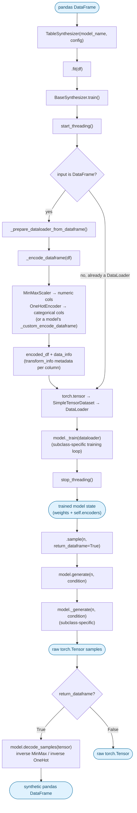
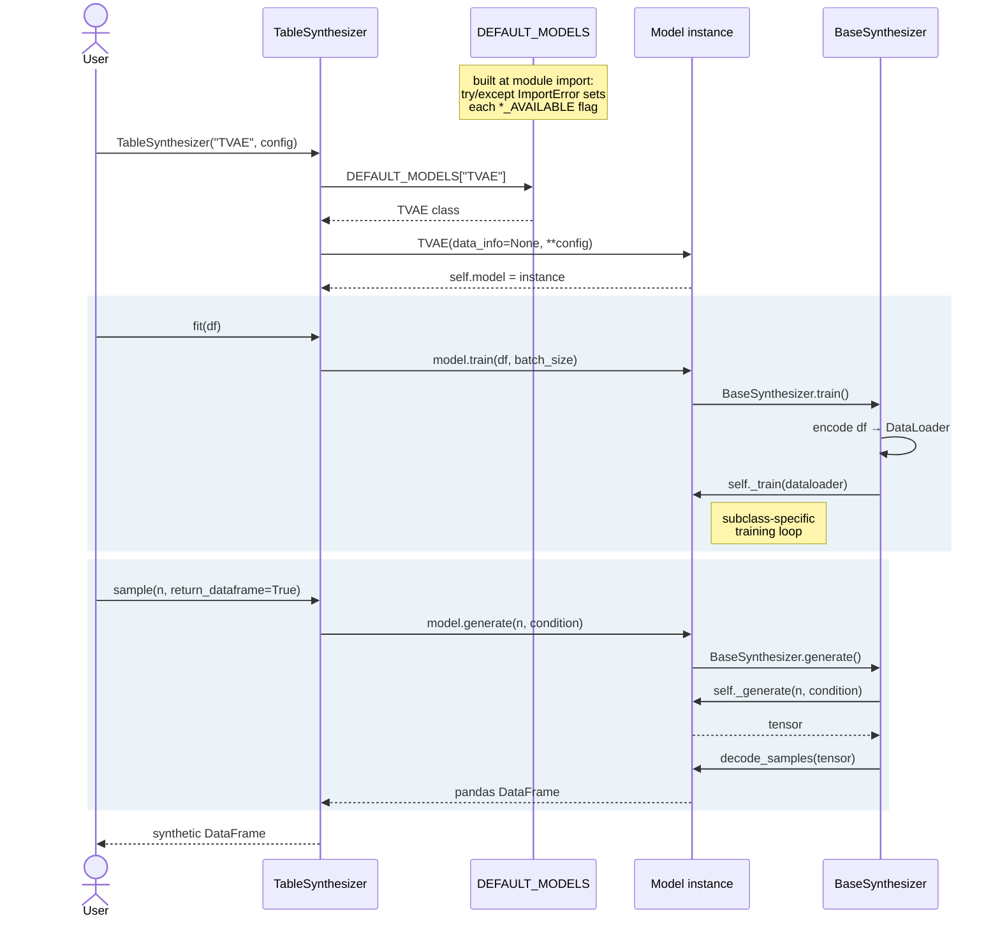

# Table Synthesizers

A comprehensive Python library for generating synthetic tabular data using 16 state-of-the-art machine learning models. Supports GANs, Variational Autoencoders, Diffusion Models, Transformers, Bayesian Networks, and privacy-preserving methods with GPU acceleration.

## Features

- **16 Synthesizer Models** with 100% success rate across all models
- **Simple DataFrame Interface** - direct pandas DataFrame input with automatic encoding
- **GPU Acceleration** - CUDA and Apple Silicon (MPS) support with automatic device detection
- **Privacy-Preserving Options** - differential privacy with AIM, PATECTGAN, and DPCART
- **Externalized Configuration** - JSON config files for all models with runtime overrides
- **Iterative Training** - batch training across multiple datasets
- **WandB Integration** - experiment tracking and monitoring
- **Comprehensive Testing** - unit, integration, and benchmark test suites

## Installation

Dependencies are split into four tiers. Install only what you need:

```bash
# Clone the repository
git clone https://github.com/ohsono/table-synthesizers.git
cd table-synthesizers

# Base only (Identity, CART, DPCART, SMOTE, AIM - no torch needed)
pip install -r requirements.txt

# Add GPU models (CTGAN, TVAE, TabDDPM, PATECTGAN, AutoDiff, TabSyn, LTM_VAE)
pip install torch torchvision --index-url https://download.pytorch.org/whl/cu130  # Blackwell SM 12.1
pip install -r requirements-gpu.txt

# Or add CPU torch models (same models, no GPU required)
pip install torch torchvision --index-url https://download.pytorch.org/whl/cpu
pip install -r requirements-cpu.txt

# Add synthcity models (BayesianNetwork, ARF, GREAT, NFlow)
pip install -r requirements-synthcity.txt
```

| File | Models | Key Packages |
|------|--------|-------------|
| `requirements.txt` | Identity, CART, DPCART, SMOTE, AIM | pandas, numpy, sklearn |
| `requirements-gpu.txt` | CTGAN, TVAE, TabDDPM, PATECTGAN, AutoDiff, TabSyn | torch (CUDA), transformers |
| `requirements-cpu.txt` | Same as GPU, on CPU | torch (CPU), transformers |
| `requirements-synthcity.txt` | BayesianNetwork, ARF, GREAT, NFlow | synthcity |

### GPU Verification

```bash
# Verify GPU availability
python -c "import torch; print(f'CUDA: {torch.cuda.is_available()}, MPS: {hasattr(torch.backends, \"mps\") and torch.backends.mps.is_available()}')"

# Print detailed GPU info
python -c "from stg.gpu_utils import print_gpu_info; print_gpu_info()"
```

See [docs/GPU_ACCELERATION_GUIDE.md](docs/GPU_ACCELERATION_GUIDE.md) for detailed GPU setup instructions.

## Quick Start

### Basic Usage

```python
import pandas as pd
from stg.tableSynthesizer import TableSynthesizer

# Load your data
df = pd.read_csv('your_data.csv')

# Initialize a synthesizer
synthesizer = TableSynthesizer('TVAE', config={
    'epochs': 100,
    'batch_size': 32,
    'embedding_dim': 128
})

# Train the model
synthesizer.fit(df)

# Generate synthetic data as a DataFrame
synthetic_df = synthesizer.sample(n=1000, return_dataframe=True)
print(synthetic_df.head())
```

### Using the Training Script

```bash
# Train a single model on a dataset
python train_all_compatible_models.py \
    --dataset insurance \
    --models CTGAN \
    --epochs 50 \
    --samples 1000

# Train all GPU-optimized models
python train_all_compatible_models.py \
    --dataset insurance \
    --group gpu \
    --epochs 50

# Train on multiple datasets iteratively
python train_all_compatible_models.py \
    --data_folder ./datasets \
    --iterate_datasets \
    --models CTGAN TVAE \
    --epochs 50

# Select a specific model for training
python train_all_compatible_models.py \
    --dataset insurance \
    --select-training-model TVAE
```

### Using Configuration Files

```bash
# Train with default config (config/default_CTGAN.json)
python train_all_compatible_models.py --dataset insurance --models CTGAN

# Train with custom config directory
python train_all_compatible_models.py \
    --dataset insurance \
    --config_dir ./my_configs \
    --models CTGAN

# Override config values at runtime
python train_all_compatible_models.py \
    --dataset insurance \
    --models CTGAN \
    --epochs 100 \
    --batch_size 256
```

See [config/README.md](config/README.md) for configuration details.

## Available Synthesizers

### Core Models (Fast, Production-Ready)

| Model | Type | Device | Description |
|-------|------|--------|-------------|
| **Identity** | Baseline | CPU | Returns training samples (for testing/baselines) |
| **TVAE** | VAE | GPU | Tabular Variational AutoEncoder |
| **SMOTE** | Statistical | CPU | Synthetic Minority Oversampling Technique |
| **CART** | Tree | CPU | Decision tree-based synthesis |
| **DPCART** | Tree + DP | CPU | Differentially private CART |
| **AIM** | DP | CPU | Adaptive and Iterative Mechanism |

### Advanced Deep Learning Models

| Model | Type | Device | Description |
|-------|------|--------|-------------|
| **TabDDPM** | Diffusion | GPU | Diffusion model for tabular data |
| **AutoDiff** | VAE+Diffusion | GPU | VAE + Diffusion hybrid |
| **CTGAN** | GAN | GPU | Conditional GAN |
| **PATECTGAN** | GAN + DP | GPU | Privacy-aware CTGAN with PATE framework |
| **TabSyn** | Hybrid | GPU | Advanced tabular synthesis (VAE + Diffusion) |
| **LTM_VAE** | VAE | GPU | Latent Table Model wrapper |

### Synthcity-Based Models

| Model | Type | Device | Description |
|-------|------|--------|-------------|
| **ARF** | Tree | CPU | Adversarial Random Forest |
| **NFlow** | Flow | GPU | Normalizing Flows |
| **BayesianNetwork** | Probabilistic | CPU | Bayesian network synthesis |
| **GREAT** | Transformer | GPU | GeneRative fEAture Transformer |

All synthcity models accept plugin-specific hyperparameters via the config dict:

```python
# Tune BayesianNetwork structure learning
synthesizer = TableSynthesizer('BayesianNetwork', config={
    'struct_learning_search_method': 'hillclimb',  # hillclimb, pc, tree_search
    'struct_learning_score': 'bic',                # bdeu, bds, bic, k2
    'struct_max_indegree': 6,
    'encoder_max_clusters': 20,
})

# Tune GREAT transformer training
synthesizer = TableSynthesizer('GREAT', config={
    'n_iter': 200,
    'batch_size': 16,
    'device': 'cuda',
})
```

See [docs/CLAUDE.md](docs/CLAUDE.md#synthcity-plugin-parameter-passthrough) for all available parameters.

## Architecture

### 1. Class abstraction

Every model inherits `BaseSynthesizer` and implements two required hooks — `_train()` and `_generate()` — plus
optional overrides for custom encoding, decoding, and checkpointing. `TableSynthesizer` is *not* a subclass: it's
a factory that holds one `BaseSynthesizer` instance as `self.model` and delegates every call to it.

```mermaid
classDiagram
    direction TB

    class BaseSynthesizer {
        <<abstract>>
        +encoders : dict
        +feature_names : list
        +__init__(data_info, epochs, seed)
        +train(data, batch_size)
        +fit(data, batch_size)
        +sample(n, return_dataframe)
        +generate(n, condition)
        +train_from_csv(path)
        +train_from_parquet(path)
        +decode_samples(samples)
        +get_state()
        +load_state(checkpoint)
        #_train(train_data)*
        #_generate(n, condition)*
        #_encode_dataframe(df)
        #start_threading()
        #stop_threading()
    }

    class TableSynthesizer {
        <<factory>>
        +model : BaseSynthesizer
        +__init__(model, config, data_info)
        +fit(data, batch_size)
        +sample(n, condition, return_dataframe)
        +register_model(new_models)$
        +get_registered_models()$
    }

    namespace CoreBaseline {
        class Identity
        class CARTSynthesizer
        class DPCARTSynthesizer
        class SMOTESynthesizer
    }

    namespace GAN_VAE {
        class CTGAN
        class PATECTGAN
        class TVAE
        class GaussianCopulaSynthesizer
    }

    namespace Diffusion {
        class TabDiffSynthesizer
        class TabDDPM
        class AutoDiffSynthesizer
        class TabSynSynthesizer
    }

    namespace PrivacyPreserving {
        class AIM
    }

    namespace FoundationModelBased {
        class TabPFGenSynthesizer
        class TabPFNUnsupervisedSynthesizer
    }

    namespace SynthcityBacked {
        class BayesianNetworkSynthesizer
        class GREATSynthesizer
        class ARFSynthesizer
        class NFlowSynthesizer
    }

    namespace LLMBased {
        class CLLMSynthesizer
    }

    BaseSynthesizer <|-- Identity
    BaseSynthesizer <|-- CARTSynthesizer
    BaseSynthesizer <|-- DPCARTSynthesizer
    BaseSynthesizer <|-- SMOTESynthesizer
    BaseSynthesizer <|-- CTGAN
    BaseSynthesizer <|-- PATECTGAN
    BaseSynthesizer <|-- TVAE
    BaseSynthesizer <|-- GaussianCopulaSynthesizer
    BaseSynthesizer <|-- TabDiffSynthesizer
    BaseSynthesizer <|-- TabDDPM
    BaseSynthesizer <|-- AutoDiffSynthesizer
    BaseSynthesizer <|-- TabSynSynthesizer
    BaseSynthesizer <|-- AIM
    BaseSynthesizer <|-- TabPFGenSynthesizer
    BaseSynthesizer <|-- TabPFNUnsupervisedSynthesizer
    BaseSynthesizer <|-- BayesianNetworkSynthesizer
    BaseSynthesizer <|-- GREATSynthesizer
    BaseSynthesizer <|-- ARFSynthesizer
    BaseSynthesizer <|-- NFlowSynthesizer
    BaseSynthesizer <|-- CLLMSynthesizer

    TableSynthesizer o-- BaseSynthesizer : holds as self.model
```



> `LTM_VAE` is registered in code behind `LTM_VAE_AVAILABLE`, but `src/stg/LTM_VAE.py` is excluded via `.gitignore`
> ("Exclude LTM-VAE module until further notice") and isn't present in a normal checkout, so it's omitted above as
> not currently relevant on `main`.

### 2. Data flow

A DataFrame goes in, gets encoded into a numeric tensor, trains a model-specific network, and — on sampling —
the reverse encoders turn generated tensors back into a DataFrame with the original columns, dtypes, and
categories.



### 3. Model registry & train / fit / generate

`DEFAULT_MODELS` is a plain `name → class` dict, populated at import time. Optional-dependency models only
register themselves if their import succeeded, guarded by a per-model `*_AVAILABLE` flag (e.g.
`if TABDDPM_AVAILABLE: DEFAULT_MODELS["TabDDPM"] = TabDDPM`). `TableSynthesizer.fit()`/`.sample()` are thin
delegation — all the real logic lives in `BaseSynthesizer` and its subclasses.



Registering a custom model requires only `issubclass(MyModelClass, BaseSynthesizer)`:

```python
TableSynthesizer.register_model({"MyModel": MyModelClass})
synth = TableSynthesizer("MyModel", cfg)
```

## Repository Structure

```
table-synthesizers/
├── src/stg/                       # Main library code
│   ├── base.py                    # BaseSynthesizer abstract class
│   ├── tableSynthesizer.py        # Factory class for model selection
│   ├── config_manager.py          # Configuration management
│   ├── data_manager.py            # Unified data storage
│   ├── metrics_manager.py         # Metrics tracking
│   ├── wandb_manager.py           # WandB integration
│   ├── gpu_utils.py               # GPU detection and utilities
│   ├── zero_workaround.py         # libzero replacement
│   ├── identity/                  # Identity baseline
│   ├── TVAE/                      # Tabular VAE
│   ├── CTGAN/                     # Conditional GAN
│   ├── PATECTGAN/                 # Privacy-aware CTGAN
│   ├── TabDDPM/                   # Diffusion model
│   ├── TabSyn/                    # Advanced tabular synthesis
│   ├── AutoDiff/                  # VAE + Diffusion hybrid
│   ├── LTM_VAE.py                 # Latent Table Model
│   ├── SMOTE/                     # Oversampling
│   ├── CART/                      # Decision tree
│   ├── DPCART/                    # DP decision tree
│   ├── AIM/                       # Adaptive Iterative Mechanism
│   ├── BayesianNetwork/           # Bayesian network (synthcity)
│   ├── ARF/                       # Adversarial Random Forest (synthcity)
│   ├── NFlow/                     # Normalizing flows (synthcity)
│   └── GREAT/                     # Transformer-based (synthcity)
├── src/data_loader/               # File data loading interface
├── config/                        # JSON model configuration files
│   ├── default_CTGAN.json
│   ├── default_TVAE.json
│   └── ...                        # One config per model
├── tests/                         # Test suite
│   ├── unit/                      # Unit tests per model
│   └── integration/               # Integration and end-to-end tests
├── docs/                          # Documentation
├── train_all_compatible_models.py # Main multi-model training script
├── run_comprehensive_tests.sh     # Test runner script
├── requirements.txt               # Python dependencies
└── pyproject.toml                 # Package configuration
```

## Testing

```bash
# Run all tests
pytest tests/ -v

# Unit tests only
pytest tests/unit/ -v

# Integration tests only
pytest tests/integration/ -v

# Comprehensive test script with categories
./run_comprehensive_tests.sh              # All tests
./run_comprehensive_tests.sh --core       # Core algorithms
./run_comprehensive_tests.sh --stable     # CART, DPCART, SMOTE
./run_comprehensive_tests.sh --experimental  # TabSyn, AutoDiff, CTGAN

# Test specific models
./run_comprehensive_tests.sh TVAE TabDDPM

# Quick comprehensive model test
python tests/integration/test_models_comprehensive.py --mode ultra-quick
```

## Privacy-Preserving Synthesis

```python
# AIM with differential privacy
synthesizer = TableSynthesizer('AIM', config={
    'epsilon': 1.0,
    'delta': 1e-9,
    'rounds': 100,
    'max_model_size': 80
})

# PATECTGAN with PATE framework
synthesizer = TableSynthesizer('PATECTGAN', config={
    'epsilon': 3.0,
    'epochs': 100,
    'teacher_iters': 5,
    'student_iters': 5
})

# DPCART with differential privacy
synthesizer = TableSynthesizer('DPCART', config={
    'epsilon': 1.0
})
```

## GPU Acceleration

GPU-accelerated models achieve 10-50x speedup over CPU:

| Model | GPU Speedup | GPU Memory |
|-------|------------|------------|
| CTGAN | 15-30x | 2-4 GB |
| TVAE | 10-20x | 1-2 GB |
| TabDDPM | 20-40x | 4-8 GB |
| PATECTGAN | 10-25x | 2-4 GB |
| AutoDiff | 15-30x | 4-8 GB |
| GREAT | 20-35x | 4-8 GB |
| NFlow | 10-20x | 2-4 GB |

```python
from stg.gpu_utils import detect_best_device, get_optimal_batch_size

# Auto-detect best device (CUDA > MPS > CPU)
device = detect_best_device()

# Get optimal batch size based on GPU memory
batch_size = get_optimal_batch_size(dataset_size=10000)
```

## WandB Integration

```bash
# Set up WandB
export WANDB_API_KEY="your_api_key"

# Train with WandB logging
python train_all_compatible_models.py \
    --dataset insurance \
    --models CTGAN \
    --wandb_project my-experiments
```

See [docs/WANDB_INTEGRATION_GUIDE.md](docs/WANDB_INTEGRATION_GUIDE.md) for details.

## Documentation

Full documentation is available in the [docs/](docs/) directory:

- [Documentation Index](docs/README.md) - Complete guide listing
- [GPU Acceleration Guide](docs/GPU_ACCELERATION_GUIDE.md) - GPU setup and optimization
- [Enhanced Training Guide](docs/ENHANCED_TRAINING_GUIDE.md) - Training best practices
- [Configuration Guide](config/README.md) - Model configuration system
- [Compatibility Guide](docs/COMPATIBILITY_GUIDE.md) - Platform compatibility matrix
- [WandB Integration](docs/WANDB_INTEGRATION_GUIDE.md) - Experiment tracking
- [Development Guide](docs/CLAUDE.md) - Contributing and architecture

## Contributing

1. Follow the architecture patterns in `BaseSynthesizer`
2. Implement `_train()` and `_generate()` methods in your synthesizer
3. Add a default config in `config/default_YOUR_MODEL.json`
4. Add unit tests in `tests/unit/test_your_model.py`
5. Add integration tests in `tests/integration/test_your_model_integration.py`
6. Update documentation

## Citation

If you use this library in your research, please cite:

```bibtex
@inproceedings{son2026synthony,
  title={{SYNTHONY}: A Stress-Aware, Intent-Conditioned Agent for Deep Tabular Generative Models Selection},
  author={Hochan Son and Xiaofeng Lin and Jason Ni and Guang Cheng},
  booktitle={ICLR 2026 2nd Workshop on Deep Generative Model in Machine Learning: Theory, Principle and Efficacy},
  year={2026},
}
```

## License

This project is dual-licensed under Apache-2.0 OR MIT.

- See `LICENSE-APACHE` for the Apache License, Version 2.0.
- See `LICENSE-MIT` for the MIT License.

## Attribution

This project integrates components inspired by:

- [SynthCity](https://github.com/vanderschaarlab/synthcity) (VanderSchaar Lab) - Apache License 2.0
- [TabSyn](https://github.com/amazon-science/tabsyn) (Amazon Science) - Apache License 2.0
- [AutoDiffusion](https://github.com/UCLA-Trustworthy-AI-Lab/AutoDiffusion) (UCLA Trustworthy AI Lab)

If you are an author or maintainer of any cited project and prefer a different attribution format, please open an issue.
